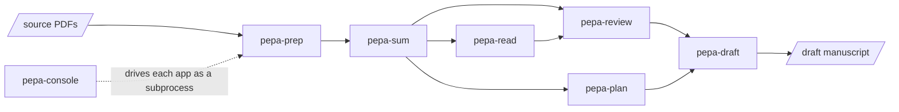

# pepa-workers 

An academic writing pipeline, split into one repository per stage so each stage can be run,
tested, and replaced on its own. Papers enter as PDFs and leave as a first draft: preparation,
summarisation, search, literature review, planning, and drafting, with a console on top that
drives all of them. Everything runs on one machine and single-user; only the language-model and
embedding calls leave it, and those can point at a self-hosted endpoint.

## Layout

```
workers/
  pepa-prep/     PDFs (born-digital, scanned, multi-chapter books) to clean markdown, fully local
  pepa-sum/      each paper to a brief, a paragraph rundown, and verified quotes
  pepa-read/     SQLite/BM25 full-text index over prep and sum output, local web UI, literature lists
  pepa-review/   embedding index over the sum corpus; literature review, gap, and synthesis workstreams
  pepa-plan/     rhetorical-move labelling and learned skeletons to a paragraph-by-paragraph outline
  pepa-draft/    plan plus review to a first draft, section by section, retrieval plus a model call
  pepa-console/  the console that drives all of the above
workers.yaml     which apps the package ships, what stays out, and each app's extra
bundle/          exports each app's committed files and writes the packaging files around them
cli/             the family's own commands: build, gate, smoke test
docs/            the logo, and the documentation site
manage.py        entrypoint: no arguments opens the menu
```

Each app keeps its own `manage.py`, requirements and README, and runs on its own from its folder.

## Pipeline



## Setup

Each app installs on its own. Enter the one you need and follow its README; there is no
family-level install step.

```powershell
cd workers/pepa-prep
pip install -r requirements.txt
python manage.py install
```

## Commands

Every app follows the same contract: `python manage.py` with no arguments opens its interactive
menu, and every menu action has a scriptable subcommand.

| Action | Command |
|---|---|
| Open the orchestration console | `cd workers/pepa-console; python manage.py` |
| Run one app's menu | `cd workers/<app>; python manage.py` |
| See one app's subcommands | `cd workers/<app>; python manage.py -h` |
| See what still blocks a release | `python manage.py check` |
| Build a wheel from every app at HEAD | `python manage.py bundle --dev` |
| Build the release wheel | `python manage.py bundle` |
| Install the newest wheel and run every command | `python manage.py test --extras all` |
| Check this repository's dependencies and the apps in `workers/` | `python manage.py install` |

## Package

`bundle` exports each app's committed files at HEAD, puts them side by side inside one wheel, and
installs one command per app.
A command puts only its own app's folder on the import path and runs that app's `manage.py`, so
every app runs in its own process exactly as it does from its folder, and two apps can both
have a `cli` and a `config` without colliding.

```powershell
pip install pepa-workers            # every released app, light dependencies
pip install "pepa-workers[sum]"     # plus what pepa-sum needs
pip install "pepa-workers[all]"     # plus everything
pepa-sum                            # one app, through its own menu
pepa-console                        # all of them, through the console
```

An app ships only when `workers.yaml` marks it released, so the manifest is the release switch;
a `v*` tag on this repository publishes.
Each app's `requirements.txt` becomes the extra named beside it, and `leave_out` drops deploy
and evaluation files, which works only for files nothing in the app imports.

`check` holds every app against the release gate: an MIT licence, no copyleft dependency, writable
paths under a data root, no sibling path built from the code folder, `--no-input` everywhere, and
a clean tree. A released app that fails the gate fails the build.
