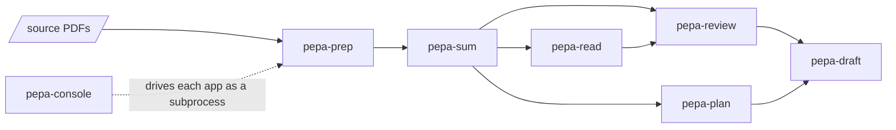

# pepa-workers 

An ensemble of standalone tools that augment academic work where it helps: reading and condensing
literature, searching what has been read, mapping a field and finding its gaps, outlining an
argument, and drafting quickly enough to test an idea before committing to it. Each worker is its
own app with its own commands, so a researcher takes only the parts they need; the judgement and
the writing stay with them, and the workers add capacity for reading, ideation, and drafting.
Everything runs on one machine for one person; only language-model and embedding calls leave it.
Those go to Anthropic's Claude, to any service that accepts OpenAI's chat format such as DeepSeek,
Kimi or Qwen, or to a model running on the same machine or on a cloud server of the user's own.

## Layout

```
workers/
  pepa-prep/     PDFs (born-digital, scanned, multi-chapter books) to clean markdown, fully local
  pepa-sum/      each paper to a brief, a paragraph rundown, and verified quotes
  pepa-read/     SQLite/BM25 full-text index over prep and sum output, local web UI, literature lists
  pepa-review/   embedding index over the sum corpus; literature review, gap, and synthesis workstreams
  pepa-plan/     rhetorical-move labelling and learned skeletons to a paragraph-by-paragraph outline
  pepa-draft/    rough section drafts from a plan and the review, to test an idea in prose
  pepa-host/     a model server of your own on Google Cloud or Azure, for any worker to use
  pepa-console/  the console that drives all of the above
workers.yaml     which apps the package ships and what each leaves out
bundle/          exports each app's committed files and writes the packaging files around them
cli/             the family's own commands: build, gate, smoke test, documentation pages
docs/            the logo, and the documentation site
manage.py        entrypoint: no arguments opens the menu
NEWS.md          what changed in each version
```

Each app keeps its own `manage.py`, requirements and README.

## How the workers share files

Where one worker can build on another's output, it reads those files from disk; the arrows show
which outputs each can use.



## Getting started

1. Install Python 3.10 or newer from [python.org](https://www.python.org/downloads/). On Windows,
   tick **Add python.exe to PATH** on the installer's first screen.
2. Open PowerShell (a terminal on macOS or Linux) and run:

```powershell
pip install pepa-workers
pepa-console
```

The console opens in the browser at `http://127.0.0.1:5190`. Its pages take the API keys and the
folders each worker reads and writes. Closing the PowerShell window stops it; `pepa-console`
starts it again, and `pip install --upgrade pepa-workers` updates every worker.
