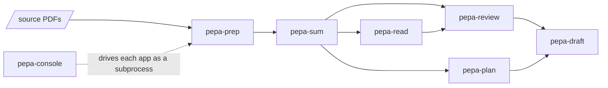

# pepa-workers 

An ensemble of standalone tools that augment academic work where it helps: reading and condensing
literature, searching what has been read, mapping a field and finding its gaps, outlining an
argument, and drafting quickly enough to test an idea before committing to it. Each worker is its
own app with its own commands, so a researcher takes only the parts they need; the judgement and
the writing stay with them, and the workers add capacity for reading, ideation, and drafting.
Everything runs on one machine for one person; only language-model and embedding calls leave it,
and those can point at a self-hosted endpoint.

## Layout

```
workers/
  pepa-prep/     PDFs (born-digital, scanned, multi-chapter books) to clean markdown, fully local
  pepa-sum/      each paper to a brief, a paragraph rundown, and verified quotes
  pepa-read/     SQLite/BM25 full-text index over prep and sum output, local web UI, literature lists
  pepa-review/   embedding index over the sum corpus; literature review, gap, and synthesis workstreams
  pepa-plan/     rhetorical-move labelling and learned skeletons to a paragraph-by-paragraph outline
  pepa-draft/    rough section drafts from a plan and the review, to test an idea in prose
  pepa-console/  the console that drives all of the above
workers.yaml     which apps the package ships, what stays out, and each app's extra
bundle/          exports each app's committed files and writes the packaging files around them
cli/             the family's own commands: build, gate, smoke test
docs/            the logo, and the documentation site
manage.py        entrypoint: no arguments opens the menu
NEWS.md          what changed in each version
```

Each app keeps its own `manage.py`, requirements and README.

## How the workers share files

Where one worker can build on another's output, it reads those files from disk; the arrows show
which outputs each can use.



## Get started

1. Install Python 3.10 or newer from [python.org](https://www.python.org/downloads/). On Windows,
   tick **Add python.exe to PATH** on the installer's first screen.
2. Open PowerShell (a terminal on macOS or Linux) and run:

```powershell
pip install "pepa-workers[all]"
pepa-console web
```

The console opens in the browser at `http://127.0.0.1:5190`. Its pages take the API keys and the
folders each worker reads and writes. Closing the PowerShell window stops it; `pepa-console web`
starts it again, and `pip install --upgrade "pepa-workers[all]"` updates every worker.

> Scanned PDFs also need [Tesseract](https://tesseract-ocr.github.io/), which pip cannot install.
> `pepa-prep install` says whether it is found.

## Commands

Every worker is also a command of its own: without arguments it opens its menu, and every menu
action has a subcommand.

| Action | Command |
|---|---|
| Open the web console | `pepa-console web` |
| Run one worker through its menu | `pepa-prep`, `pepa-sum`, `pepa-read`, `pepa-review`, `pepa-plan`, `pepa-draft` |
| See a worker's subcommands | `pepa-sum -h` |
| Check what a worker still needs | `pepa-prep install` |

## Working from the repository

Each worker also runs from its own folder without the package:

```powershell
cd workers/pepa-sum
pip install -r requirements.txt
python manage.py
```

The repository's own `manage.py` builds the package. `bundle` exports each app's committed files
at HEAD into one wheel with one command per app; a command puts only its own app's folder on the
import path and runs that app's `manage.py`, so two apps can both have a `cli` and a `config`
without colliding.

```powershell
python manage.py install            # the build's own dependencies
python manage.py check              # what still blocks a release
python manage.py bundle --dev       # a wheel from every app
python manage.py bundle             # the release wheel, released apps only
python manage.py test --extras all  # install the newest wheel and run every command
```

An app ships only when `workers.yaml` marks it released, so the manifest is the release switch;
a `v*` tag on this repository publishes the `version` it names, which matches the top entry of
`NEWS.md`.
Each app's `requirements.txt` becomes the extra named beside it, and `leave_out` drops deploy
and evaluation files, which works only for files nothing in the app imports.

`check` holds every app against the release gate: an MIT licence, no copyleft dependency, writable
paths under a data root, no sibling path built from the code folder, `--no-input` everywhere, and
a clean tree. A released app that fails the gate fails the build.
