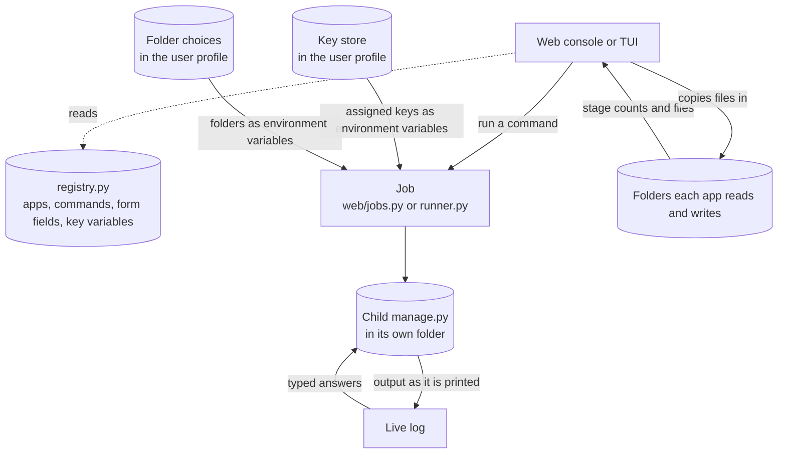

# pepa-console

Running the pepa suite by hand means a terminal per app and remembering which of pepa-prep, pepa-sum, pepa-read, pepa-review, pepa-plan, and pepa-draft does what. pepa-console collapses that into one place with two faces: a local web console in the browser, currently a test version, and a full-screen text user interface (TUI) in the terminal. Both drive each child app only through its own `manage.py`, as a subprocess started in the child's folder, and never import a child's code, so the children stay independent and unchanged. Everything stays on this machine: the web console answers only on 127.0.0.1, and the keys it stores live in the user profile, outside the workspace.

## Data flow



## Layout

```
manage.py       entrypoint: no arguments opens the TUI, `web` opens the browser console
registry.py     hand-maintained table of child apps, commands, form fields, and key variables
runner.py       the TUI's subprocess runner
console/        the Textual TUI: command tree, live log, reactive sidebar
web/            the browser console: routes, jobs, folders, key store, templates
cli/ui.py       styled output for the headless subcommands
```

## Setup

```powershell
pip install -r requirements.txt
python manage.py install
```

`install` checks that Textual and Flask are present and reports which child folders it finds.

## Commands

Running `python manage.py` with no arguments opens the TUI, provided the terminal is a real one; everything else is a subcommand:

| Action | Command |
|---|---|
| Open the web console in the browser | `python manage.py web` |
| Launch the TUI | `python manage.py` |
| List every app and its commands | `python manage.py status` |
| Show effective configuration | `python manage.py config` |
| Run one child command headlessly, streaming its output | `python manage.py run <app> <command> [extra flags]` |
| Check dependencies and child folders | `python manage.py install` |

## Web console

`python manage.py web` serves the console on port 5190 and opens a browser tab; `--no-browser` skips the tab and `--port N` picks another port.

| Page | What it does |
|---|---|
| Pipeline | Counts PDFs waiting, prepared texts, and summaries, and shows when each index was last built. Link a source folder points the apps at PDFs where they already are; Copy PDFs in copies chosen files into the apps' own folders and names the folders it copied to. Run runs the ticked stages in order (prepare, summarise, update the search index, update the review index), and a stage that fails skips the rest. The run's steps and live log stay on the page. |
| Apps | One card per app, each opening a page with every command as a form built from its flags. Run starts the command in place, with its live log under the form, so several commands can run side by side. File and folder fields suggest the folders the app uses and their newest files; the page also shows which key the app gets, and one card per folder, each openable in the file manager. |
| Folders | Where every app reads and writes, one row per folder, with a picker that browses this computer. The folders below. |
| Read | Starts `pepa-read serve` on its own port and shows the search page inside the console. |
| Jobs | Every job and pipeline run since the console started, each opening a full-height live log. |
| Keys | The key manager, below. |

Each command carries a kind: **safe** runs at once; **heavy** asks first, since it does real work and may call a paid model; **service** runs until it is stopped; **interactive** asks questions as it runs, answered in a box under its log; **terminal** asks for keys as it runs, so its form is replaced by the terminal command to type, and the Keys page is the place for keys.

### Folders

Each app comes with its own `input/` and `output/` folders, and the Folders page points it somewhere else instead: a folder of PDFs where they already live, or a results folder on another drive. A job receives its folders as environment variables, the same way it receives keys, so no child's `config.yaml` or `secrets.yaml` is ever written from here.

A folder marked **read only** is one you linked yourself. pepa-prep reads the PDFs and writes its markdown elsewhere; pepa-sum reads papers and writes its documents elsewhere; nothing in a linked folder is written, moved, renamed, or deleted. A results folder is created if it is not there yet, and the console refuses to put results inside a read-only folder. Since a browser cannot hand a page a path from your computer, the picker lists the real folders from the console process instead: drives on Windows, the home folder elsewhere.

A library that keeps each paper in a folder of its own, as a reference manager writes them, looks empty one level deep. The Folders page counts what lies below as well, so the source folder of pepa-prep or pepa-sum offers **Scan N in sub-folders** whenever there is something down there, and saying yes is what tells the app itself to read that way. Those two folders are the only ones that can be read deeply; the counts on the Pipeline page and the app's own file list follow the same choice. A count stops early on a very large or very slow folder and shows the number it reached with a plus.

Copying files in is a separate action that says so. An app's page offers **Copy files here** on the folders the app owns and **Open folder** on the rest, and every copy reports how many files it copied and into which folder. Nothing is copied into a folder you linked: to add a paper there, open it and put the file in yourself, or point the app back at its own folder.

Choices live in `folders.json` beside the key store, so they survive a restart and stay out of the workspace.

### Keys

The key manager stores a key once, under a name, and decides which apps receive it. A job gets its assigned keys as environment variables, which every pepa app reads before its own `secrets.yaml` or `env.yaml`; an app left on "own file" keeps using that file. One key can serve every app that reads its variable, and an app can also be given a key of its own. The store is `%APPDATA%\pepa-workers\keys.json` on Windows and `~/.config/pepa-workers/keys.json` elsewhere, and a value is never shown again once saved.

> The store is a plain JSON file in the user profile, readable by anything running as that user: the same protection each app's own `secrets.yaml` has.

### Safety

The console answers only on 127.0.0.1 and refuses requests addressed to any other host name. Every form post must carry a token that changes each time the console starts, so another website open in the same browser cannot start a job. Quitting the console stops every job it started.

### Settings

| Environment variable | Default | Controls |
|---|---|---|
| `PEPA_CONSOLE_PORT` | `5190` | the console's port |
| `PEPA_CONSOLE_READ_PORT` | `5151` | the port pepa-read serves on |
| `PEPA_CONSOLE_UPLOAD_LIMIT_MB` | `500` | the largest batch of files the browser may send at once |
| `PEPA_CONSOLE_POLL_MS` | `700` | how often a log page asks for new lines |
| `PEPA_CONSOLE_KEYS_FILE` | the profile path above | where the key store lives |

## How a command runs

Launching a command, from either face, builds `python manage.py <command> <default flags> [--no-input where supported] [form or extra flags]` and runs it with the child's folder as working directory. The web console merges stdout and stderr into one live log, because the apps' `ui.py` prints its status lines on stdout, and reads it in pieces rather than whole lines, so a question printed without a newline shows at once. Whenever the log ends on such an unfinished line, an answer box appears; what is typed there goes to the child's stdin and is echoed into the log, as a terminal would. A child that first checks for a real terminal before asking takes its quiet path instead, which is why those commands carry their choices as form fields. The TUI and `manage.py run` close stdin, stream stderr live, and hand back stdout once the child exits.

## Caveats

- Test version. Jobs live in memory and are gone once the console stops.
- The TUI lists interactive child commands but does not drive them; the web console does.
- Folder choices and stored keys reach a job started from the web console. A job started from the TUI or from `manage.py run` receives neither, and falls back to each app's own `config.yaml`, `env.yaml`, and `secrets.yaml`.
- Answers typed into a job appear in its log, so a key goes on the Keys page, never into an answer.
- Children run under the console's own Python interpreter, so their dependencies must be installed in the same environment.
- Only pepa-prep's and pepa-sum's source folders can be read with their sub-folders; every other folder is counted one level deep.
- A folder moved inside an app's own settings file, rather than on the Folders page, is not followed.
- The registry is copied by hand from each child's subparsers and needs updating when a child's commands change.
- The TUI shows stdout only when a job ends, so an app that prints its progress on stdout looks idle there until it finishes.
