# pepa-console

Running the pepa suite by hand means opening a terminal per app and remembering which of pepa-sum, pepa-review, pepa-plan, pepa-prep, and pepa-draft does what. pepa-console exists to collapse that into one screen: a full-screen orchestration TUI (text user interface) that lists every child app's commands in a tree, launches the one picked, and streams its output live. It drives each child only through its existing `manage.py` contract as a subprocess, spawned in the child's own directory, and never imports a child's code, so the children stay independent and unchanged. It holds no secrets of its own; each child resolves its own `secrets.yaml` when it runs.

## Data flow

```mermaid
flowchart TD
    USER["Pick a command<br/>in the tree"] --> KIND{"kind?"}

    KIND -->|"safe &middot;"| SPAWN["Spawn child as subprocess<br/>runner.py"]
    KIND -->|"heavy &#9654;"| CONFIRM["Confirm dialog"]
    CONFIRM --> SPAWN
    KIND -->|"interactive &#10007;"| SKIP["Not driven:<br/>open in a terminal instead"]

    SPAWN --> CHILD[("Child manage.py<br/>runs in its own folder")]
    CHILD -->|"stderr, line by line"| LOG["Live log pane"]
    CHILD -->|"stderr, line by line"| SIDE["Sidebar: pid, status,<br/>elapsed, exit code, last line"]
    CHILD -->|"stdout, captured whole"| RESULT[("Result")]

    REG[("registry.py<br/>hand-maintained app + command table")] -.defines tree.-> USER

    classDef store fill:#e8f0fe,stroke:#4285f4,color:#1a1a1a;
    classDef route fill:#e6f4ea,stroke:#34a853,color:#1a1a1a;
    class CHILD,RESULT,REG store;
    class SPAWN,CONFIRM route;
```



## Layout

```
manage.py       entrypoint (no args opens the TUI; subcommands are its scriptable twin)
registry.py     hand-maintained table of child apps, their commands, and each command's kind
runner.py       spawns a child as a subprocess and streams its stderr live
console/app.py  the Textual TUI: command tree, live log, reactive sidebar
cli/ui.py       styled output for the headless (non-TUI) face
```

## Setup

```
pip install -r requirements.txt
python manage.py install
```

`install` checks that Textual is present and reports which of the registered child folders it can actually find.

## Commands

Running `python manage.py` with no arguments opens the TUI, provided the terminal is a real one (stdin and stdout both a tty); otherwise call an action directly:

| Action | Command |
|---|---|
| Launch the orchestration TUI | `manage.py` |
| List every app and its commands | `manage.py status` |
| Show effective configuration | `manage.py config` |
| Run one child command headlessly, streaming its output | `manage.py run <app> <command> [extra flags]` |
| Check dependencies and confirm child folders exist | `manage.py install` |

## How a command runs

Every command in the tree carries a kind, set by hand in `registry.py`: safe commands are read-only or dry-run and launch immediately; heavy commands do real work, and may call an LLM or cost money, so the TUI confirms first; interactive commands have no non-interactive path at all and are listed for visibility only, not driven, since the console has no embedded terminal yet.

Launching a command, from the TUI or from `manage.py run`, builds the same underlying call: `python manage.py <command> <default flags> [--no-input if the child supports it] [extra flags]`, run as a subprocess with its working directory set to the child app's own folder. The child's stderr, its own step plan and `[i/N]` progress lines, is read and forwarded line by line as it arrives rather than buffered until exit, so the log pane never goes dead mid-run. The child's stdout is captured whole and handed back as the result once the process exits: the TUI's log pane and sidebar update live, while the headless `run` face writes stdout to the console's own stdout and stderr to its own stderr, so piping `manage.py run ... > out.txt` captures only the result.

The sidebar tracks one job at a time: the app and command running, the kind, the process id, elapsed time, the exit code once it lands, and the last line seen, coloured by status (running, ok, failed, idle).

## Caveats

- Prototype. Interactive-only child commands are listed but not driven; there is no embedded terminal yet.
- The sidebar shows process facts only; token or cost columns wait until a child opts into structured `--json` output.
- The command registry in `registry.py` is maintained by hand from each child's real subparsers; it does not yet auto-discover from `--help`.
