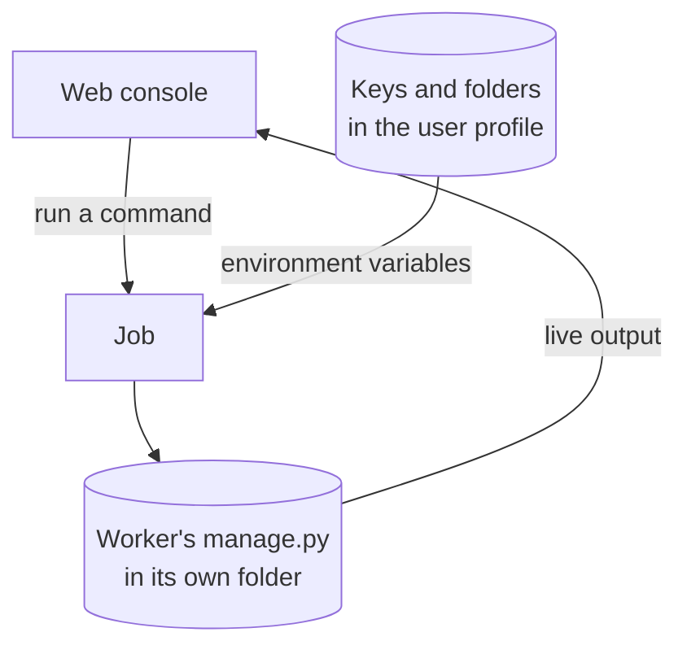

# pepa-console

One local web page for all the pepa workers. Pick a worker, fill in a form, and watch it run;
keys and folders are set once and handed to every worker. It runs each worker through its own
`manage.py` and answers only on this machine.

## How it works



| Page | What it does |
|---|---|
| Library | The items and how far each stage has got; drop PDFs on it to add them, tick items to process only those, and press Process items to run the stages in order |
| Apps | One page per worker, each command as a form with its live log, its run settings, and every file it reads or writes |
| Search | The pepa-read search page |
| Jobs | Every run, kept for as long as chosen there |
| Settings | Folders: the project folder, and where each worker reads and writes. Models: which model and server each worker writes and embeds with. Keys: store a key once and choose which workers get it |
| Guide | How to start, and what each worker does |

## Setup

```powershell
pip install -r requirements.txt
python manage.py install
```

## Commands

| Action | Command |
|---|---|
| Open the web console | `python manage.py` |
| List every worker and its commands | `python manage.py status` |
| Run one worker command | `python manage.py run <app> <command>` |
| Check dependencies | `python manage.py install` |
