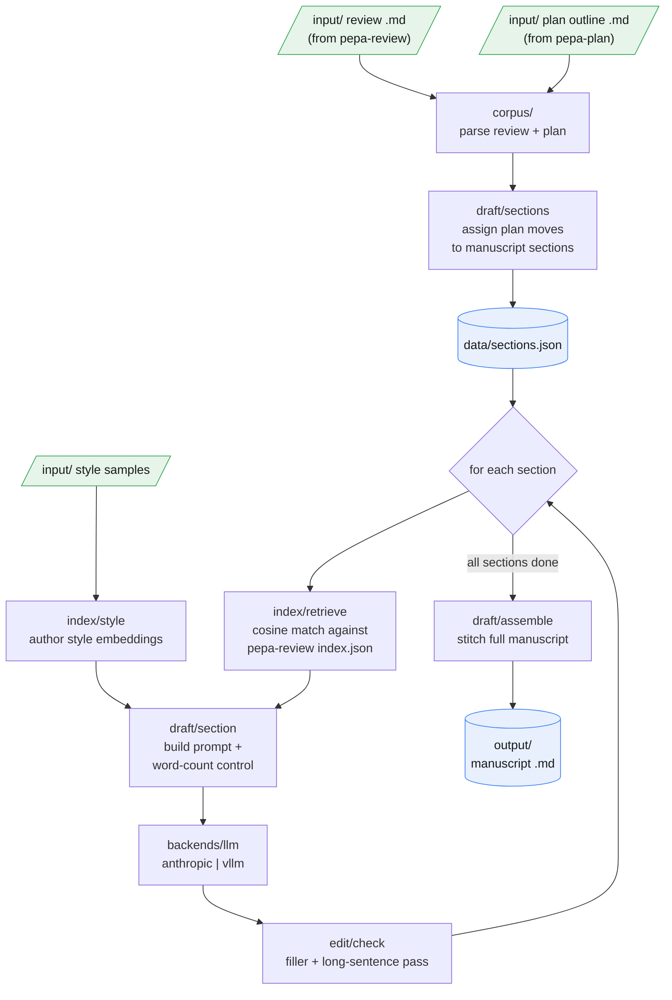

# pepa-draft

The purpose of pepa-draft is to turn the rest of the pepa suite into an actual manuscript draft. Once pepa-review has surveyed the literature and pepa-plan has laid out a paragraph-by-paragraph outline, pepa-draft can turn these inputs into a first rough draft. It reads both files, assigns each planned move to a manuscript section, and then, for every section, retrieves the most relevant literature passages by embedding similarity (matching the section's topic against the review's indexed passages), optionally mixes in examples of the author's own writing, and calls a language model to draft the prose to a target word count. Only the model call leaves the machine, and even that can point at a self-hosted vLLM instance, so drafting can stay off metered APIs entirely. The vision of pepa-draft is not to write papers automatically but to increase the process of rapid ideation, moving from manuscript idea to plan to draft to see how an idea for a paper might look like.

## Data flow



## Layout

```
manage.py       entrypoint (no args opens the menu)
config.py       config loader (env, then secrets.yaml, then defaults)
corpus/         discover and parse the review and plan inputs
index/          embedding retrieval: literature passages and author style
draft/          section assignment, per-section drafting, and assembly
edit/           post-draft checks for filler and over-long sentences
backends/       the LLM router: Anthropic API or a vLLM proxy
cloud/          vLLM Cloud Run image and its Flask readiness proxy
cli/            menu and per-command UI
input/          review .md, plan .md, and style samples (gitignored)
output/         generated manuscripts (gitignored)
data/           index files and section assignments (gitignored)
```

## Setup

```
pip install -r requirements.txt
python manage.py install
```

`install` creates `secrets.yaml` from the template. Fill in your keys:

```yaml
anthropic_api_key: sk-ant-...
gemini_api_key: AIza...        # for embeddings; or set ollama_base_url instead
```

Then drop a pepa-review output and a pepa-plan outline into `input/`:

```
input/review_my_topic.md
input/outline_my_topic.md
```

## Commands

Run `python manage.py` with no arguments for the interactive menu, or call any action directly:

| Action | Command |
|---|---|
| Draft a full manuscript from the review and plan | `manage.py draft` (`--no-retrieval`, `--no-style`, `--backend vllm`) |
| Assign plan moves to manuscript sections | `manage.py sections` (`--reset` to restore label defaults) |
| Manage author writing samples for style matching | `manage.py style add \| list \| build` (`--file`, `--profile`) |
| Show the effective configuration | `manage.py config` |
| Configure API keys and paths interactively | `manage.py setup` |
| Set up files and check dependencies | `manage.py install` |

When run without explicit `--review` and `--plan` files, `draft` picks the review and outline out of `input/` on its own.

## Section assignment

Before any prose is written, every planned move has to land in a manuscript section. On the first run pepa-draft does this by the move's own label, so a `[HOOK_PROBLEM]` move goes to the Introduction and a `[FINDING]` move goes to the Findings, and it saves the result to `data/sections.json`. That file is reused on later drafts, so the assignment is worth getting right once. Run `python manage.py sections` to move items between sections by hand, or `--reset` to throw the manual changes away and fall back to the label defaults.

## Author style matching

A machine draft tends to read like the machine, so pepa-draft can pull the author back in. Index one or more of your own papers, and for each section it retrieves the paragraphs most similar to that section's content and injects them into the prompt as worked examples of how you write. The draft then leans towards your phrasing rather than a generic register.

```
python manage.py style add --file input/my_previous_paper.txt
python manage.py style build
```

Samples can be grouped into named profiles with `--profile`, so a different voice can be used for a different kind of paper.

## vLLM backend

For bulk drafting without per-token API costs, deploy `cloud/Dockerfile.vllm` to Cloud Run on a GPU instance, set `vllm_base_url` and `vllm_token` in `secrets.yaml`, and pass `--backend vllm`. The proxy answers `/healthz` the moment it starts, so Cloud Run's readiness probe passes while the model is still loading, and `/generate` returns 503 until vLLM is actually ready. That way a cold start never looks like a crash.

## Cost

A full manuscript runs to around 8,000 words across six sections and makes roughly 6 to 12 Anthropic API calls, depending on how many word-count expansion passes a section needs. At claude-opus-4-8 pricing a single full draft costs on the order of $0.50 to $2.00, driven mostly by context size (the style examples and retrieved passages). Pointing `--backend vllm` at a warm Cloud Run instance avoids the per-call cost.

> Estimates only. Actual cost depends on prompt length, retrieved context, and current API pricing.
