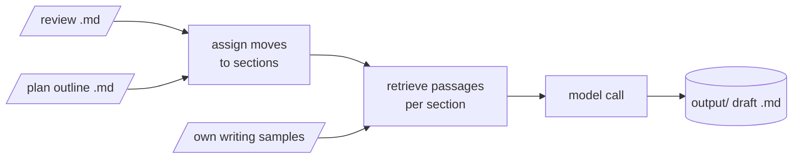

# pepa-draft

Turns a pepa-review literature review and a pepa-plan outline into rough section drafts, so an idea
for a paper can be read in prose before committing to it. Only the model call leaves the machine,
and it goes to Claude or any server that accepts OpenAI's chat format, including a self-hosted vLLM
service built from `cloud/Dockerfile.vllm`.

## How it works

Each planned move is assigned to a section. For every section, pepa-draft retrieves the most
relevant passages from the review's index and examples of the author's own writing, and asks a
language model for the prose.



## Setup

```powershell
pip install -r requirements.txt
python manage.py install
```

`install` creates `secrets.yaml`; fill in the Anthropic key, or `backend`, `llm_base_url` and
`llm_model` for another provider, and a Gemini key for embeddings. Put a review and an outline into
`input/`.

## Commands

| Action | Command |
|---|---|
| Draft from the review and outline | `python manage.py draft` |
| Move planned items between sections | `python manage.py sections` |
| Add, list or index own writing samples | `python manage.py style add`, `list`, `build` |
| Show the configuration | `python manage.py config` |
| Set keys and folders | `python manage.py setup` |
| Check dependencies | `python manage.py install` |
