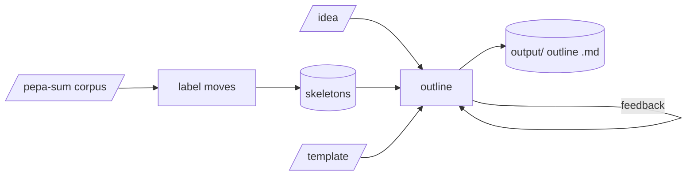

# pepa-plan

Turns a paper idea into a paragraph-by-paragraph outline. Papers in a field share a shape even when
nobody writes it down; pepa-plan learns that shape from summarised papers and outlines a new idea
along it, or along a template written by hand. Only the model calls leave the machine.

## How it works

Each paragraph in the pepa-sum corpus is labelled with the rhetorical move it makes (background,
method, finding and so on), and the move sequences are clustered into a few reusable skeletons. An
outline follows one skeleton or template and is refined through feedback until it is ready.



## Setup

```powershell
pip install -r requirements.txt
python manage.py install
```

Add the Anthropic key to `secrets.yaml`, or set `backend`, `llm_base_url` and `llm_model` for
another provider, and put an idea file into `input/`.

## Commands

| Action | Command |
|---|---|
| Learn skeletons from the pepa-sum corpus, labelling only papers added since | `python manage.py abstract` |
| Learn how each section unfolds paragraph by paragraph | `python manage.py blueprint` |
| Outline an idea | `python manage.py outline` |
| Create or list hand-written templates | `python manage.py template` |
| Check a draft's argument against a template | `python manage.py review` |
| Show the configuration | `python manage.py config` |
| Check dependencies | `python manage.py install` |
