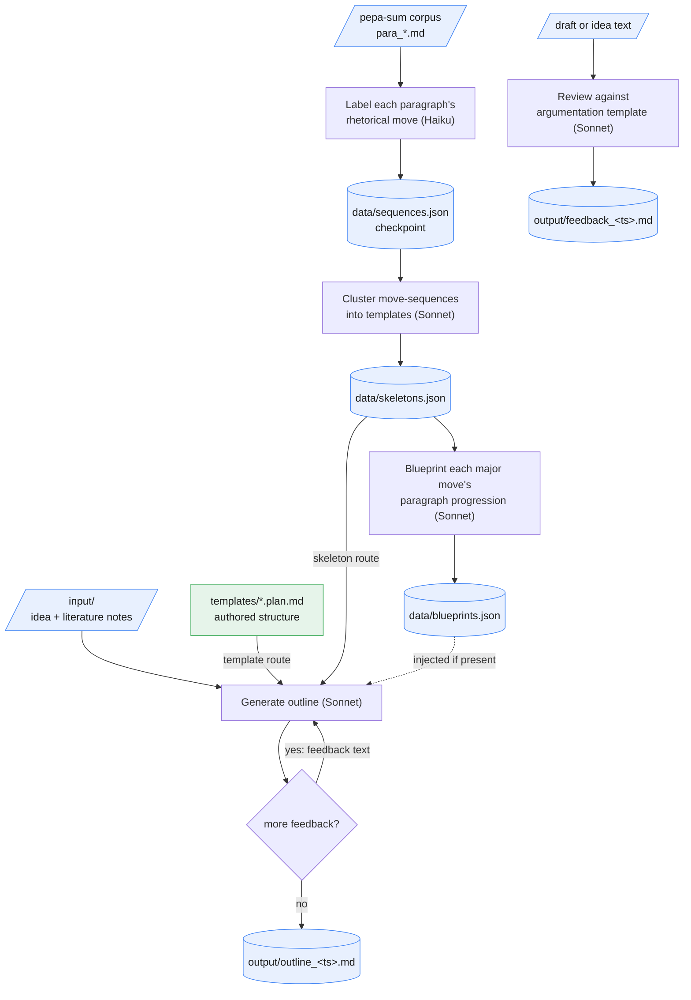

# pepa-plan

The aim of pepa-plan is to turn a paper idea into a workable outline. This is usually easiest when there is a known shape to write towards, and papers within a field tend to share one even when nobody has written it down. The tool learns that shape by reading a corpus of already-summarised papers, labelling each paragraph with the rhetorical move it performs (background, method, finding, and so on), and clustering the resulting move-sequences into a handful of reusable skeletons. From there it follows either a hand-authored template or one of those learned skeletons to generate a paragraph-by-paragraph outline for a new idea, refining it through a short feedback loop, and it can also check a draft's argumentation flow against the same template. Everything runs locally and single-user; only the language-model calls themselves leave the machine.

## Data flow



## Layout

```
manage.py              entrypoint (no args opens the menu)
config.py               corpus dir, model IDs, paths, env-var overrides
backends/               generation layer: Anthropic client, LLM calls, prompt assembly
corpus/                 reads and joins pepa-sum's para_ files
skeleton/                labels moves, synthesises skeletons and blueprints
plan/                   generates and iterates outlines
cli/                    menu and per-command UI
templates/              example.plan.md, plus your own *.plan.md structures
data/                   skeletons.json, blueprints.json (gitignored)
input/                  drop idea files and literature notes here (gitignored)
output/                 outlines, feedback, skeleton reports (gitignored)
secrets.example.yaml    committed template; secrets.yaml is gitignored
```

## Setup

```
pip install -r requirements.txt
python manage.py install      # creates secrets.yaml, checks deps, reports para file count
python manage.py              # launch menu
```

Add an API key to `secrets.yaml`:

```yaml
anthropic_api_key: "sk-ant-..."
```

If `pepa-sum` lives somewhere other than `../pepa-sum`:

```yaml
corpus_dir: "C:/path/to/pepa-sum/output"
```

`PEPAPLAN_CORPUS_DIR`, `PEPAPLAN_INPUT_DIR`, and `PEPAPLAN_OUTPUT_DIR` move the corpus, the idea folder, and the results folder without editing `secrets.yaml`, which is how pepa-console points the app at folders you chose.

Then drop an idea file into `input/`, and optionally build the skeleton library first so outlining has a learned structure to draw on (see Commands below).

## Commands

Run `python manage.py` with no arguments for the interactive menu, or call any action directly:

| Action | Command |
|---|---|
| Build the skeleton library from the pepa-sum corpus | `manage.py abstract` |
| Build within-section paragraph-progression blueprints | `manage.py blueprint` |
| Outline a paper | `manage.py outline` |
| Manage plan templates | `manage.py template` |
| Review argumentation | `manage.py review` |
| Show effective configuration | `manage.py config` |
| Check dependencies and set up files | `manage.py install` |

## Building the skeleton library

`abstract` reads every `para_*.md` file in the corpus, labels each paragraph with a rhetorical move via Claude Haiku, then asks Claude Sonnet to cluster the move-sequences into three to six canonical structural templates. The library is saved to `data/skeletons.json`, and a human-readable report goes to `output/skeletons_<ts>.md`.

The labelled sequences are checkpointed to `data/sequences.json` before the clustering step, so a failure during clustering never discards the paid labelling work. Move sequences are long and near-unique per paper, so for very large corpora the clustering call runs on a representative sample that fits the model's context window (the full set is still saved to `data/sequences.json`).

```
python manage.py abstract
```

Use `--sample N` for a random sample of N papers, or `--limit N` for the first N files only.

Labelling is one fast call per paper, so for large corpora it runs in one of three modes, chosen by `--mode` (default `auto`, picked by estimated wall-clock):

| Mode | What it does | Best for |
|---|---|---|
| `serial` | one paper at a time | a single paper or a tiny corpus |
| `parallel` | a bounded thread pool of live calls | up to a few thousand papers |
| `batch` | the Anthropic Message Batches API, about 50% cheaper, asynchronous (up to about an hour) | thousands of papers |

`auto` switches to `batch` around a few thousand papers. The final clustering call is always live. A per-run token and cost estimate prints when the build finishes.

In `batch` mode the batch id is printed when the batch is submitted. A completed batch's results stay retrievable from the API for 29 days, so if the run is interrupted after the batch finishes, the library can be rebuilt from its saved results file without re-billing the labelling:

```
python -m skeleton.recover path/to/batch_results.jsonl
```

## Within-section blueprints

A skeleton stage such as `ANALYSIS_FINDING` is usually a run of several paragraphs, not one. `blueprint` adds the level below the skeleton: for each skeleton and each of its major moves (those over a share threshold), it describes how that section typically unfolds, paragraph by paragraph, as an ordered list of sub-moves with a typical paragraph count.

It needs no re-labelling. The `para_` summary text is re-read from the corpus and joined back to the move labels already in `data/sequences.json` (their numbering aligns), so only the synthesis calls are new. Each major move's real sections are gathered from its skeleton's example papers, and one Sonnet call returns the progression. The result is a standalone add-on, `data/blueprints.json`, plus a report in `output/`; the skeleton library itself is untouched.

```
python manage.py blueprint
```

When an outline is generated with a learned skeleton, any blueprints that exist are injected automatically, so the generated plan expands each multi-paragraph stage through its sub-move progression.

Example papers are also selected deterministically: each skeleton lists the twenty corpus papers whose move distribution most closely matches it, so the basis is real and verifiable rather than model-named.

## Outlining a paper

Drop an idea as `.md`, `.txt`, or `.docx` into `input/` (or supply a path when prompted). A literature notes file is optional. Then choose how the plan is structured, either a plan template authored by hand (see below) or a learned skeleton. A first outline comes back, and feedback can be entered in an iterative loop until the plan is ready. The final outline is saved to `output/outline_<ts>.md`.

```
python manage.py outline --input input/my-idea.md
```

`--literature FILE` adds notes, `--template FILE` or `--skeleton-id ID` picks the structure directly, `--feedback TEXT` runs one scripted pass instead of a prompt, and `--no-input` returns the first shot with no feedback loop at all.

## Plan templates

A plan template is a markdown file describing the exact section and paragraph progression an outline should follow, for example Introduction, four paragraphs: (1) real-world context, (2) problems and gaps, (3) approach and findings, (4) arguments and conclusions. When a template is selected, the generator reproduces that structure verbatim instead of relying on a learned skeleton, so outlining works even before the skeleton library has been built.

Copy the shipped `templates/example.plan.md`, edit it to the desired structure, then pick it when outlining. Templates live in `templates/`; personal copies are gitignored.

```
python manage.py template --new "empirical paper"   # copies the example
python manage.py template --list
```

## Reviewing argumentation

Pass any idea or draft text. The tool checks it against the argumentation-flow template and returns structured feedback: overall flow, a stage-by-stage walkthrough, and concrete fixes. Output is saved to `output/feedback_<ts>.md`.

```
python manage.py review --input input/my-draft.md
```

## Cost estimates

| Operation | Model | Approx. cost |
|---|---|---|
| Label one paper's moves | Claude Haiku | ~$0.001 |
| Build skeleton library (100 papers) | Haiku + Sonnet | ~$0.15 |
| Build within-section blueprints | Claude Sonnet | ~$0.40 (one call per major move) |
| Generate outline | Claude Sonnet | ~$0.03 |
| Refine outline (one pass) | Claude Sonnet | ~$0.04 |
| Review argumentation | Claude Sonnet | ~$0.02 |

> Estimates only, verify current pricing in the Anthropic console before relying on them.
> Building in `batch` mode bills the per-paper labelling at about 50%.
