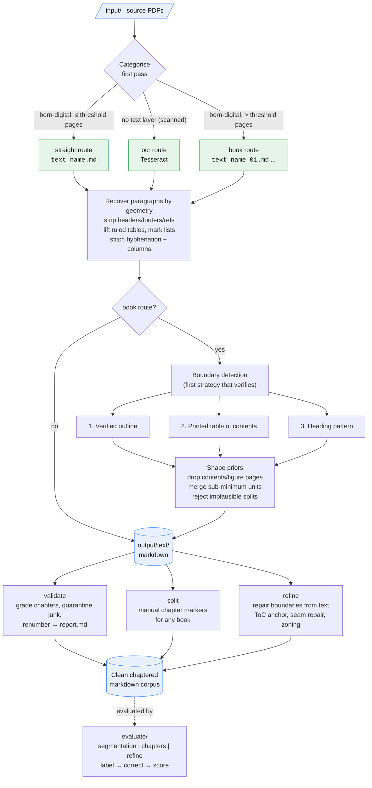

# pepa-prep

The job of pepa-prep is to produce clean, uniform text, and PDFs almost never come that way. It takes a folder of PDFs, whether born-digital papers, multi-chapter books, or scanned volumes, and turns each one into clean markdown, so the later stages can work on the content instead of fighting the layout. Everything runs locally and deterministically, with no API calls, so the source material never leaves the machine.

## Data flow



## Layout

```
manage.py       entrypoint (no args opens the menu)
config.yaml     input/output paths and extraction options
extract/        the extraction engine: categorise, geometry, boundary detection, OCR
refine/         post-processing that repairs chapter files from the text alone
evaluate/       accuracy harnesses that grade the pipeline against gold sets
cli/            menu and per-command UI
input/          drop PDFs here (gitignored)
output/text/    extracted markdown lands here (gitignored)
```

## Setup

```
pip install -r requirements.txt
python manage.py install
```

Then drop your PDFs into `input/` and run `python manage.py` for the menu, or call any command directly.

## Commands

Run `python manage.py` with no arguments for the interactive menu, or call any action directly:

| Action | Command |
|---|---|
| Convert PDFs to clean markdown | `manage.py extract` |
| Grade, quarantine, and renumber a book's chapters | `manage.py validate` (`-n` to preview) |
| Correct chapter boundaries by hand | `manage.py split` (`--file` for one book) |
| Repair chapter boundaries from the text | `manage.py refine` (`--apply` to write) |
| Fetch bibliography metadata for pepa-sum papers | `manage.py biblio` (`--cite` for citation networks) |
| Check dependencies | `manage.py install` |
| Label and score paragraph/heading/list segmentation | `manage.py label` / `score` |
| Label and score chapter detection | `manage.py label-chapters` / `score-chapters` |
| Label and score refinement | `manage.py label-refine` / `score-refine` |

## How extraction works

Each PDF gets categorised on a first pass. A born-digital paper under the page threshold takes the straight route and becomes a single `text_<name>.md`; a longer born-digital file is treated as a book and split into numbered chapter files; a scanned PDF with no text layer goes through Tesseract OCR and is then handled like the others.

Whichever route it took, paragraphs are recovered from the page geometry, the bounding-box gaps and indentation, rather than by trusting the PDF's own text blocks, which are usually wrong. Along the way the running headers and footers, page numbers, and reference lists are stripped, and sentences split across columns are stitched back together.

A hyphen at a line break is only closed up when the book itself writes that word solid somewhere else; if it writes it hyphenated, the hyphen stays, so a genuine compound survives the rejoin. Ligatures are expanded, soft hyphens and zero-width characters dropped, and accents composed, while curly quotes and dashes are left exactly as they were printed, because pepa-sum verifies quotes against this text character by character.

Ruled tables are lifted out as markdown tables and their cells are kept out of the surrounding prose, so a table no longer arrives as a paragraph of loose numbers. Only tables the PDF actually draws rules around are taken; a text-alignment guess would turn every two-column page into a table. Bulleted lists become markdown list items, and a numbered list is recognised where a block holds at least two numbered items, so a sentence that merely opens with "1." is left as prose.

For books there is one more problem: where do the chapters begin. pepa-prep tries three strategies in turn and takes the first that actually verifies against the printed page.

1. **Verified outline.** If the PDF carries an embedded outline, every level of it is checked against the headings actually printed in the body, matching titles fuzzily and assembling multi-line ones. The shallowest chapter-shaped level wins. An outline whose titles never appear in the body, or that lists one entry per page, is rejected rather than trusted.
2. **Printed table of contents.** Failing that, the contents pages are found structurally, as rows of titles with page numbers, and each printed page number is converted to a real PDF page through a calibrated offset. This still works on OCR-noisy scans, where misread digits are repaired and titles matched fuzzily.
3. **Heading pattern.** As a last resort, `Chapter`/`Kapitel`/`Part`/`Teil` headings are detected, whether numbered, roman, or spelled out. A run of headings with no real body text between them (a contents page, a block of endnotes) is not treated as a set of boundaries.

Whatever the strategy finds is then held to a set of shape priors, because a plausible-looking split is often still wrong. Contents and figure-list pages are dropped, title-page fragments before the first real chapter are discarded, units below a minimum size merge into their neighbour, boundaries pull back over blank pages and title-only dividers, and a wildly implausible split (dozens of units a few pages long) is thrown out so the next strategy can try. Each book's result line names the strategy it used and the share of titles that verified, and warns about ordinal gaps ("no chapter 7"), numbering restarts, and suspicious unit shapes. If nothing verifies at all, the book is written as a single file with a warning.

## Getting the chapters right

Splitting a book cleanly is the hard part, and it does not always come out right on the first pass. Three commands deal with what is left over, and they run from the automatic to the manual.

`validate` is the automatic tidy-up. It grades a book's chapter files against each other by length, paragraph density, and how much of the file is citation lines, moves anything that reads like a reference list or an empty fragment into `output/_review/`, and renumbers the survivors. A file that still holds two or more `Chapter`/`Part` headings is flagged as a likely missed split but left in place. Add `-n` to see the verdicts without moving anything.

`refine` is the repair pass, and it works from the markdown alone, no source PDF needed, which matters because re-extracting a large OCR corpus is slow. It re-finds the printed contents page in the text and re-anchors the split to it, demotes a "heading" that turns out to be a running head repeated on every page, rejoins boundaries that fall mid-sentence, and quarantines front and back matter (indexes, bibliographies, copyright pages) by their textual density rather than by any keyword list. Every repair is gated by the same shape priors, so nothing is allowed to make a book's shape less plausible. On its own it only diagnoses and writes a report; add `--apply` to commit the repairs, and `--book STEM` to limit it to one book.

`split` is the manual escape hatch for when the automatic passes get a book wrong. It searches every extracted book, whichever route it took: type part of an author or title, pick from the matches, and the book opens in your editor. A book that came out as a single block opens as one file for you to drop `<!-- chapter -->` lines into; a book already split into chapters opens as one file with a marker at each current boundary, so you move, add, or remove markers to correct an over- or under-split. On save it rewrites that book's numbered chapter files. Pass `--file PATH_OR_STEM` to jump straight to one book.

## Evaluation

Every part of the pipeline that makes a judgement can be scored against a hand-checked gold set, so that a change to the extractor can be measured rather than eyeballed across a few files. The three harnesses all work the same way: `label` writes a correctable file seeded with the tool's current guesses, those guesses get corrected by hand, and `score` re-runs the live pipeline and compares it to the corrections. Because scoring re-runs the real pipeline, later improvements re-score without any relabelling.

| Harness | What it grades | Reports |
|---|---|---|
| Segmentation | paragraph, heading, and list boundaries | precision/recall/F1, over- vs under-segmentation, Pk and WindowDiff |
| Chapter detection | book chapter boundaries | F1 at 1-page tolerance, exact-page rate, strategy used, page offset |
| Refinement | boundary repair, from the markdown only | a before/after match score against the corrected chapter starts |

Refinement is the case worth watching, and the one to read sceptically. On the twenty-book reference set it breaks even: the match score is identical before and after the repair pass, and no book is made worse. Two gates hold it there, both set from the sweep that produced the number. `refine_unit_slack` stops a book gaining more chapters than the contents entries that actually anchored to a body heading, and `refine_snap_lines` is `0`, which keeps a boundary from being dragged onto a contents anchor; every non-zero distance measured worse, as did lifting the chapter cap.

Read that break-even with the caveat that the reference books have already had `refine --apply` run on them, so the pass is being scored on its own past output and finds little left to do. The gates are what the sweep supports; the claim that the boundary repairs help a book that has never seen them is not yet evidenced. Rebuilding the reference set from unrefined extractions is what would settle it.

## Configuration

Edit `config.yaml` or use the Configure menu:

| Key | Default | Description |
|---|---|---|
| `input_folder` | `./input` | Folder of source PDFs |
| `output_folder` | `./output` | Parent output folder; markdown lands in `<output_folder>/text/` |
| `workers` | `4` | Parallel extraction threads |
| `book_page_threshold` | `100` | Pages above this take the book route |
| `max_chapters` | `80` | Splits with more units than this are rejected as spurious |
| `toc_headings` | `contents, ...` | Words that mark a contents-page heading (lowers the bar; never required) |
| `ocr_dpi` | `300` | Rasterisation DPI for scanned pages |
| `tesseract_cmd` | `""` | Full path to the tesseract binary, or blank to use PATH |
| `refine_snap_lines` | `40` | How far `refine` may move a boundary to reach a contents anchor |
| `refine_unit_slack` | `1` | Chapters `refine` may add beyond the contents entries that anchored |

Already-extracted files are skipped on a re-run.

## OCR

OCR is optional, and only kicks in for scanned PDFs with no text layer. To enable it:

```
pip install pytesseract Pillow
```

Install the Tesseract binary separately (see <https://github.com/tesseract-ocr/tesseract>), and set `tesseract_cmd` in the config if it is not on your PATH.
