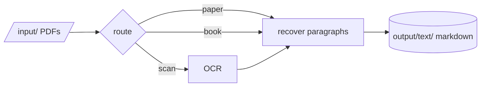

# pepa-prep

Turns a folder of PDFs (papers, multi-chapter books, scanned volumes) into clean markdown that the
other workers can read. Everything runs locally, with no model calls.

## How it works

Each PDF takes one of three routes. A short born-digital paper becomes one markdown file, a long
one is treated as a book and split into chapter files, and a scan goes through Tesseract OCR first.
Paragraphs are recovered from the page layout; headers, footers, page numbers and reference lists
are stripped. Book chapters are found from the PDF's outline, its printed table of contents, or its
chapter headings.



## Setup

```powershell
pip install -r requirements.txt
python manage.py install
```

Put the PDFs into `input/`.

## Commands

| Action | Command |
|---|---|
| Convert PDFs to markdown | `python manage.py extract` |
| Grade a book's chapters and set aside junk files | `python manage.py validate` |
| Repair chapter boundaries from the text | `python manage.py refine` |
| Correct chapter boundaries by hand | `python manage.py split` |
| Fetch bibliography metadata | `python manage.py biblio` |
| Check dependencies | `python manage.py install` |
