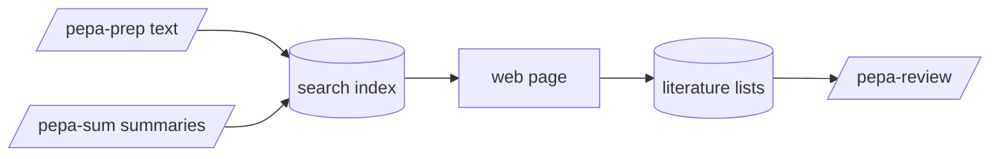

# pepa-read

Search across every paper pepa-prep has extracted and pepa-sum has summarised, by author, argument,
method or free text, from a local web page. Results can be gathered into literature lists for
pepa-review. Nothing leaves the machine.

## How it works

pepa-read builds a full-text index of the markdown files and ranks matches by relevance. Each
summary section (question, methods, arguments, conclusions and so on) is searchable on its own, so
`methods:interviews author:smith` finds just those papers. Plain words also search each paper's
prepared text; papers that match only there follow those whose summary matches. A result opens in
its default app.



## Setup

```powershell
pip install -r requirements.txt
python manage.py install
python manage.py index
```

## Commands

`python manage.py` opens the search page in the browser.

| Action | Command |
|---|---|
| Build or update the index | `python manage.py index` |
| Search from the terminal | `python manage.py search "query"` |
| Open a document | `python manage.py open <id>` |
| Show literature lists | `python manage.py lists` |
| Show one list | `python manage.py list-show NAME` |
| Export a list for pepa-review | `python manage.py list-export NAME` |
| Delete a list | `python manage.py list-delete NAME` |
| Check dependencies | `python manage.py install` |
