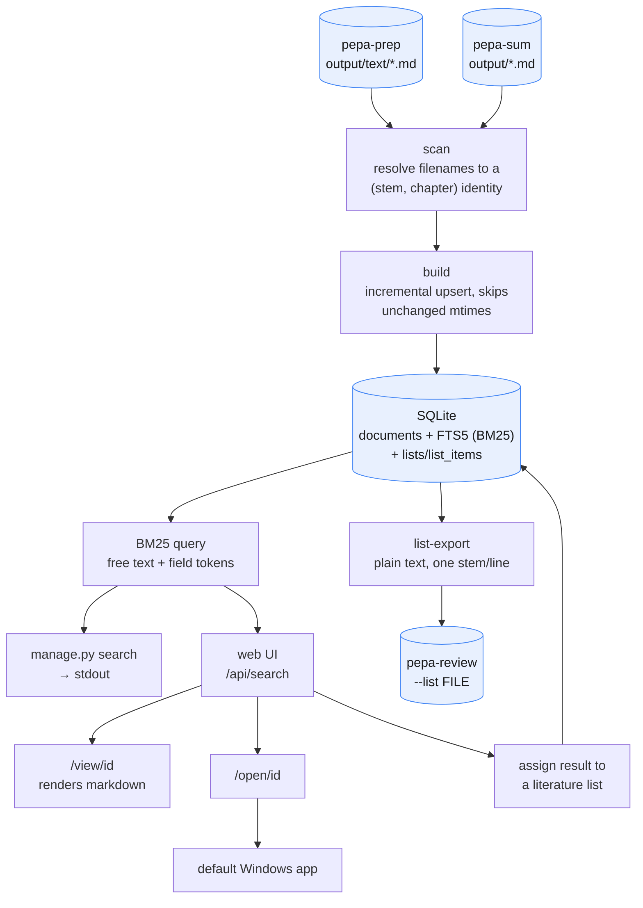

# pepa-read

The task that pepa-read fulfiles is reltated to how Windows File Explorer search cannot keep up once the pepa-prep extracted text and pepa-sum summaries run into thousands of markdown files. Hunting for a paper by author, argument, or method becomes a matter of luck. pepa-read answers with a small SQLite full-text index, ranked by BM25, built once and queried instantly, then exposes it through a local web UI with one-click open in the file's default Windows app, plus a one-shot search command for scripting. It is read-only with respect to the source corpus, never writing to pepa-prep or pepa-sum output, and it makes no LLM or network calls. Everything runs on `127.0.0.1`, so nothing leaves the machine except its own SQLite index. That index also holds user-curated literature lists, so results can be organised while reading and exported as input to pepa-review.

## Data flow



## Layout

```
manage.py       entrypoint (bare invocation serves the web UI)
config.py       source dirs, db path, port; env-var overridable
cli/            styled terminal output, install checks
index/          scan, incremental build, schema, literature lists
search/         BM25 query, shared by the CLI and the web API
web/            Flask app, routes, templates, static assets
data/           reader.db lives here (gitignored)
```

## Setup

```
pip install -r requirements.txt
python manage.py install
```

`install` checks dependencies and confirms the pepa-prep/pepa-sum source directories are reachable. Add `pip install markdown` for nicer rendering of the `/view/<id>` page; it falls back to plain text if not installed.

By default pepa-read looks for source files at `../pepa-prep/output/text` and `../pepa-sum/output`, relative to its own folder, as a sibling of those repos. Override with environment variables if the corpus lives elsewhere:

```
PEPA_READER_TEXT_DIR=D:\corpus\text
PEPA_READER_SUM_DIR=D:\corpus\sum
PEPA_READER_DB_PATH=D:\corpus\reader.db
PEPA_READER_PORT=5151
```

Build the index once before searching:

```
python manage.py index
```

## Commands

Running `python manage.py` with no arguments builds the index if it does not exist yet, starts the local web UI, and opens it in the browser; Ctrl-C stops the server. In a non-interactive shell it instead prints a pointer to the commands below and exits, since there is no terminal to serve into.

| Action | Command |
|---|---|
| Serve the web UI (bare invocation) | `manage.py` |
| Scan pepa-prep + pepa-sum and (re)build the index | `manage.py index` (`--force` to reindex everything) |
| One-shot search to stdout | `manage.py search "query"` |
| Serve the web UI explicitly | `manage.py serve` (`--port N`, `--no-browser`) |
| Open a document in its default Windows app | `manage.py open <id>` (`--which text\|sum`) |
| Check dependencies and source directories | `manage.py install` |
| Show all literature lists and their item counts | `manage.py lists` |
| Show the documents in a literature list | `manage.py list-show NAME` |
| Export a list's document stems, one per line | `manage.py list-export NAME` (`-o FILE`) |
| Delete a literature list | `manage.py list-delete NAME` |

## Searching

A query can filter by field inline: `author:`, `title:`, `context:` (question and context), `empirical:`, `lit:` (literature drawn on), `methods:`, `arguments:`, `conclusions:` (key conclusions), `discussion:` (discussion items), combinable with free text and each other, for example `manage.py search "lit:foucault author:aaker brand"`. `author:` is also available as an explicit `--author aaker` flag.

`open <id>` picks the summary file if one exists, otherwise the raw text; pass `--which text` or `--which sum` to choose explicitly when a document has both. The web UI's Text and Summary columns do the same through dedicated buttons, since a document can have either or both files.

Chapter-split books (`text_<stem>_01.md`, `_02.md`, and so on) are indexed as independent rows, one per chapter, rather than rolled up into a single parent work. The index stores each pepa-sum section, question and context, empirical context, literature drawn on, methods, arguments, key conclusions, discussion items, as its own searchable field, so a query can target one specifically through the field tokens above. A pepa-prep-only document with no summary yet is still discoverable by its title.

## Literature lists

Each search result row has a Lists cell where a document can be assigned to one or more named lists through a dropdown, or a new list created on the fly. A Manage literature lists panel below the results allows renaming, deleting, or exporting any list. Exporting, through the web Export link or `manage.py list-export`, writes a plain-text file, one document stem per line, the same filename-derived identity pepa-sum and pepa-review use as `base`, which pepa-review's `review --list FILE` (or its Import list selection menu) can consume directly.

## Caveats

> Upgrading pepa-read to a newer index schema clears the existing index automatically, since it is fully rebuildable from the source files, and reindexes from scratch on the next `index` run; that takes as long as the original build.

Indexing is incremental: a file is only re-parsed when its modified time changes, or `--force` is passed.
