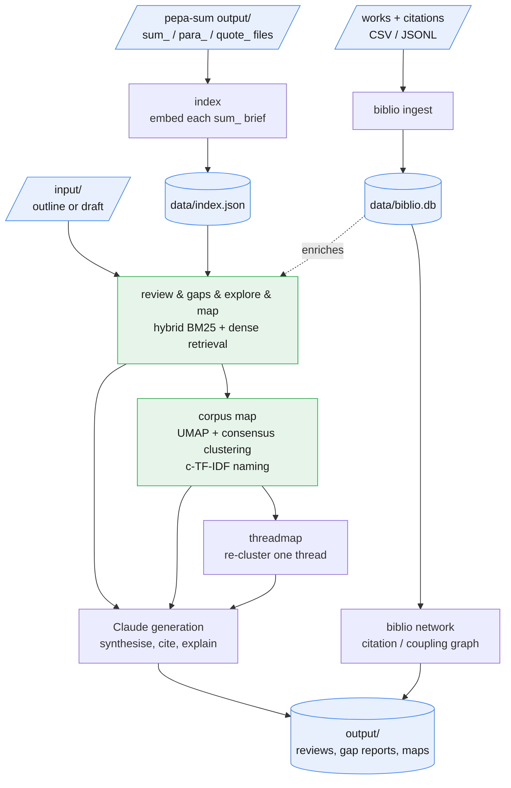

# pepa-review

pepa-review exists because a folder of `pepa-sum` briefs, one `sum_`/`para_`/`quote_` triple per
paper, only becomes useful once it can be searched, related, and drawn on for writing, and doing
that by hand stops scaling past a handful of papers. It builds a local embedding index over that
corpus and then supports four research workstreams from it: assembling a literature review from an
outline, checking a draft for works it has missed, an interactive discovery loop for questions
about the literature, and a thematic map of how the corpus clusters. Everything stays on the
machine except the generation and embedding calls, which go out to Claude and Gemini (or, for
embeddings, a local Ollama endpoint), so the corpus and the index built from it never leave it.

## Embedding backend

| Backend | Where it runs | Cost | Notes |
|---|---|---|---|
| Gemini `gemini-embedding-001` | hosted | ~$0.002 per 100 papers | default once `gemini_api_key` is set |
| Ollama `nomic-embed-text` | local | free | used automatically once `ollama_base_url` is set |

## Data flow



## Layout

```
manage.py              entrypoint (no args opens the menu)
config.py               CORPUS_DIR, model IDs, paths, env-var overrides
corpus/                 discovers and parses sum_/para_/quote_ files from pepa-sum
index/                  builds and queries the embedding index, and the corpus-map clustering
backends/                Claude/Gemini clients and the generation prompts
biblio/                 optional bibliographic enrichment: ingest, export, network, storage
cli/                    menu and per-command UI
lib/                    vendored front-end assets for exported citation-network HTML pages
data/                   index.json, biblio.db (gitignored, kept via .gitkeep)
input/                  drop draft files and outlines here (gitignored)
output/                 generated reviews, gap reports, and corpus maps (gitignored)
secrets.example.yaml    committed template; secrets.yaml is gitignored
```

## Setup

```
pip install -r requirements.txt
python manage.py install      # creates secrets.yaml, checks deps
python manage.py              # launch menu
```

Add API keys to `secrets.yaml`:

```yaml
anthropic_api_key: "sk-ant-..."
gemini_api_key: "AIza..."
```

If `pepa-sum` lives somewhere other than `../pepa-sum`:

```yaml
corpus_dir: "C:/path/to/pepa-sum/output"
```

`PEPAREVIEW_CORPUS_DIR`, `PEPAREVIEW_INPUT_DIR`, and `PEPAREVIEW_OUTPUT_DIR` move the corpus, the draft folder, and the results folder without editing `secrets.yaml`, which is how pepa-console points the app at folders you chose.

Then build the index:

```
python manage.py index
```

## Commands

Run `python manage.py` with no arguments for the interactive menu, or call any action directly:

| Action | Command |
|---|---|
| Build or refresh the embedding index | `manage.py index` (`--force` to rebuild) |
| Assemble a literature review from an outline | `manage.py review` |
| Check a draft for works it is missing | `manage.py gaps` |
| Explore the corpus interactively | `manage.py explore` |
| Generate a thematic corpus map | `manage.py map` |
| Re-cluster one thread of a saved map | `manage.py threadmap` |
| Ingest, export, or graph bibliographic data | `manage.py biblio ingest\|export\|stats\|network` |
| Show effective configuration | `manage.py config` |
| Check dependencies and set up files | `manage.py install` |

## Literature review

An outline goes into `input/`, or straight into an editor if none is given, and the works to draw
on get selected one of three ways: map-guided (themes retrieved from the outline, refined by
free-text feedback), by typing author surnames or title keywords and picking from the numbered
results, or by importing a stem list, a plain-text file with one document `base` per line, as
exported by pepa-reader's literature-list feature. From there the review is either drafted along
the outline's own structure or synthesised into three or four sections built from the literature's
key terms and tensions. When bibliographic enrichment is switched on, older highly-cited works are
paired with nearby recent ones as anchors, staging the debates that structure a section.

```
python manage.py review --input input/my-outline.md
python manage.py review --auto              # auto-selects the top-10 works by similarity
python manage.py review --list my-list.txt  # select works from a stem list
```

## Gap-check a draft

A draft `.md` or `.txt` in `input/` gets chunked, and each chunk is compared against the corpus by
hybrid BM25 and dense similarity, combined through reciprocal rank fusion. Works that come back
close to the draft but are absent from its citations are flagged as gaps, and Claude explains why
each one is relevant. Output lands in `output/gaps_<timestamp>.md`.

```
python manage.py gaps --input input/my-draft.md
```

## Explore the literature

An interactive query loop over the indexed briefs: ask about themes, methods, arguments, or a
specific author, and each query retrieves the top eight briefs by hybrid retrieval before Claude
synthesises an answer and suggests follow-up questions.

```
python manage.py explore
python manage.py explore --query "how do scholars theorise algorithmic power?"
```

## Corpus map

Every indexed work is clustered into thematic threads and written out as a Markdown report, each
thread carrying a discussion, key arguments, key concepts, dominant methods, and empirical
contexts, with its works listed below. Clustering follows an ensemble embedding-text recipe, dense
embeddings plus title and literature TF-IDF, reduced with UMAP, then consensus clustering (HDBSCAN,
spherical k-means, and Ward fused through a co-association matrix). Granularity is picked by
silhouette score, and c-TF-IDF grounds the thread names and merges near-duplicate threads. Each
work is assigned by its consensus strength: a bridging work can appear under a second thread, and
one that fits nothing well lands in a final "Cross-cutting / outliers" section rather than being
forced in.

```
python manage.py map                # auto-selects the thread count
python manage.py map --threads 12   # forces a target thread count
```

Output is saved to `output/corpus_map_<timestamp>.md`, alongside a `corpus_map_<timestamp>.json`
sidecar that records each thread's works by index id. The full pipeline needs optional
dependencies; without them the map degrades to a plain k-means clustering.

```
pip install scikit-learn umap-learn hdbscan
```

## Thread-level map

The corpus map's thread count is capped relative to corpus size, so a large thread can stay coarse.
Rather than forcing the whole map finer, which thins every thread at once, `threadmap` drills into
one thread: the same clustering pipeline re-runs over just that thread's works at a finer
granularity band. It picks a saved map, then one thread or all of them.

```
python manage.py threadmap                        # pick map and thread interactively
python manage.py threadmap --thread all            # detail every thread of the newest map
python manage.py threadmap --map corpus_map_<ts>.md --thread 3
```

Works are recovered from the map's `.json` sidecar; a map generated before the sidecar existed
falls back to matching its rendered work list against the index. Output lands in
`output/thread_map_<thread>_<timestamp>.md`.

## Bibliographic enrichment

Off by default, and gated behind `use_biblio: true` in `secrets.yaml`. Ingesting a works and
citations file (CSV or JSONL) builds `data/biblio.db`, computing PageRank and in-degree authority
scores for the corpus's internal citation graph as it goes. Once switched on, the literature review
uses that graph to pick its debate anchors and the corpus map adds a citation-similarity channel
alongside the embedding one. `stats` prints coverage counts, `export` writes the works and
citations back out as CSV, and `network` builds the citation or bibliographic-coupling graph and
exports it as an interactive HTML page or GraphML for another tool.

```
python manage.py biblio ingest --works works.csv --citations citations.csv
python manage.py biblio stats
python manage.py biblio network --graph-type coupling --format graphml
```

## Cost estimates

| Operation | Model | Approx. cost |
|---|---|---|
| Index papers (once) | Gemini `gemini-embedding-001` | ~$0.002 per 100 papers |
| Gap-check a 5,000-word draft | Claude Haiku | ~$0.005 |
| Literature review (10 works) | Claude Sonnet | ~$0.09 |
| Discovery query | Claude Haiku | ~$0.002 |
| Corpus map (per thread) | Claude Sonnet | ~$0.01 |
| Thread-level map (per sub-thread) | Claude Sonnet | ~$0.01 |

> Estimates only, verify current pricing in the vendor console before relying on them. Embedding
> costs are negligible; generation costs dominate.
