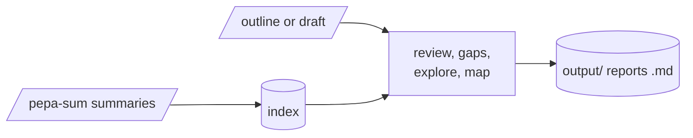

# pepa-review

Works with the literature pepa-sum has summarised: assemble a literature review from an outline,
find works a draft is missing, ask questions of the literature, and map how a field clusters into
themes. Only the model and embedding calls leave the machine.

## How it works

Every summary is embedded into a local index. Each task retrieves the closest works by meaning and
by keyword, and Claude writes the review, explains each gap, or answers the question. The map
groups all works into thematic threads and names each one.



## Setup

```powershell
pip install -r requirements.txt
python manage.py install
python manage.py index
```

Add the Anthropic and Gemini keys to `secrets.yaml` before building the index, or name other
providers there with `backend` and `embed_provider`.

## Commands

| Action | Command |
|---|---|
| Build or update the index | `python manage.py index` |
| Assemble a literature review from an outline | `python manage.py review` |
| Find works a draft is missing | `python manage.py gaps` |
| Ask questions of the literature | `python manage.py explore` |
| Map the field into themes | `python manage.py map` |
| Map one theme in finer detail | `python manage.py threadmap` |
| Add citation data | `python manage.py biblio` |
| Show the configuration | `python manage.py config` |
| Check dependencies | `python manage.py install` |
