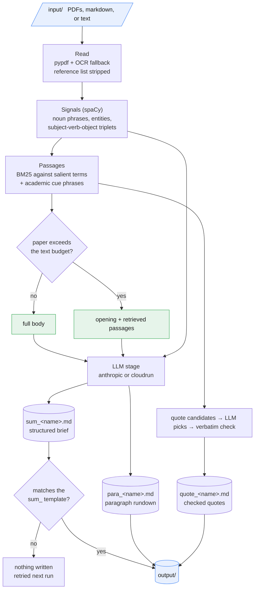

# pepa-sum

pepa-sum takes a folder of papers, born-digital or scanned PDFs, or already-extracted markdown or text (pepa-prep output fits directly), and turns each one into three Markdown documents: a structured brief, a paragraph-by-paragraph rundown, and a set of verbatim quotes checked against the source. All the expensive reading, OCR, the spaCy pass, BM25 retrieval, reference stripping, happens locally; only a compact, signal-enriched prompt goes to the language model, and only the `anthropic` backend sends anything off the machine at all. The reasoning behind the split into three documents is deliberate. A downstream reader can scan the briefs to decide which papers matter, then draw on the rundowns and quotes for detail when writing something up, such as a literature review.

## Backends

| Backend | When | Notes |
|---|---|---|
| `anthropic` (default) | normal use | Claude Haiku, priced per paper |
| `cloudrun` | self-hosted | Qwen-3B on Cloud Run, scale-to-zero; needs a deploy first |

Switch with `python manage.py settings` (saved to `env.yaml`, applied to every run).

## Data flow



## Layout

```
manage.py              entrypoint (no args opens the menu)
config.py               effective config: backend, settings, paths, budget
cli/                    command modules (summarize, settings, install, config, deploy) + ui/progress
extract/                local preprocessing: read the source, strip references, signals, passages, paragraphs
documents/              builds the three output documents (summary, rundown, quotes)
backends/               LLM routing (anthropic / cloudrun) and prompts
render/                 writes <prefix>_<name>.md
serve/                  the self-hosted cloudrun backend (Dockerfile, deploy scripts, optional)
env.yaml.example        template, safe to commit (env.yaml is gitignored)
input/ output/ data/    runtime folders (gitignored, kept via .gitkeep)
```

## Setup

```
pip install -r requirements.txt
python -m spacy download en_core_web_sm
python manage.py install      # creates env.yaml, checks dependencies
python manage.py              # launch menu
```

Set `anthropic_api_key` in `env.yaml` (or the `ANTHROPIC_API_KEY` environment variable) for the default backend.

> **Self-hosted backend (optional):** run `python manage.py settings`, choose `cloudrun`, then `python manage.py deploy`. Deployment is Windows-first, `deploy` runs `deploy.ps1` (PowerShell, no `bash` needed); a POSIX mirror, `deploy.sh`, is also provided.

> **Scanned PDFs (optional OCR):** image-only pages need `pip install pytesseract pdf2image` plus the system tools tesseract and poppler. Without them, born-digital PDFs still work; scanned pages are skipped with a warning.

## Commands

Run `python manage.py` with no arguments for the interactive menu, or call any action directly:

| Action | Command |
|---|---|
| Summarise every paper in the input folder | `manage.py summarize` |
| Delete failed outputs and their paired files | `manage.py clean` |
| Choose backend and paragraph-rundown method | `manage.py settings` |
| Print effective config and cost note | `manage.py config` |
| Create env.yaml, store the API key, check dependencies | `manage.py install` |
| Build and deploy the self-hosted fallback service | `manage.py deploy` |

Flags such as `--input`, `--output`, `--force`, `--mode`, and `--dry-run` are documented behind `manage.py <command> -h`.

## How a paper is processed

Reading starts with pypdf pulling the text layer straight out of the file; a page with no text layer at all falls back to local OCR through tesseract. The reference list is stripped immediately, since it adds tokens without adding anything to summarise.

A single spaCy pass then produces the signals: the recurring noun phrases, the named entities, and the subject-verb-object triplets that make up the raw material of the paper's claims. Those signals feed a BM25 retrieval step, TREC-style, that scores passages against the paper's own salient terms plus a set of academic cue phrases, keeping the top passages along with any labelled sections such as abstract, methods, or conclusion.

From there the three documents are built. The brief combines the signals with the body text, or, for a paper too large to fit the model's context, with the opening plus the retrieved passages instead, so a long paper still gets summarised quickly and within budget. The paragraph rundown either has the model condense each paragraph in turn or, in the extractive method, picks the most central sentence per paragraph with no model call at all, depending on the `PARA_METHOD` setting; on the `anthropic` backend the model-based method runs its paragraph batches concurrently. The quotes document works the other way round: BM25 surfaces candidate passages, the model picks the most expressive ones, and a deterministic check then drops anything that does not actually appear in the source text, verbatim.

A summary is only written once it matches the `sum_` template, a `##` title plus its bold fields. When the model returns something else instead, a refusal, an error, or the prompt echoed back, that paper counts as a failure and no `sum_` file is written at all, so a re-run retries it rather than leaving a stub behind. This holds in every execution mode.

A brief that runs past the output-token budget before its closing fields (conclusion, direction of future research) is treated the same way: it counts as a failure, no `sum_` file is written, and a re-run regenerates it. The cut-off text is not discarded, though; it is saved under `output/_truncated/` so the point of the cut can be inspected. The budget itself is deliberately generous, so this is rare and usually points to an unusually long paper rather than a limit set too low.

`manage.py clean` clears any failed `sum_` files already sitting on disk, removing each one that lacks the template along with its paired `para_` and `quote_` files, so those papers get redone on the next `summarize` run. Add `--dry-run` to see what would go first, `--force` to skip the confirmation.

> A paper too large for the model's context is skipped with a clear message rather than aborting the run, and a re-run alone will not fix it, since the failure is not transient. Lowering the text budget lets its body be summarised from the opening plus retrieved passages instead of in full.

## Execution modes

A run picks how to execute by estimated wall-clock time for the number of papers that still need work; this is `--mode auto`, the default.

| Mode | What it does | Best for |
|---|---|---|
| `serial` | one paper at a time, with a live per-step spinner | a single paper, or the `cloudrun` backend |
| `parallel` | local reading runs across processes, escaping the GIL, a bounded look-ahead ahead of the LLM thread pool, so the next papers' spaCy and BM25 work happens on the CPU while the current papers' LLM calls wait on the network | tens to a couple of hundred papers |
| `batch` | the same prompts go to the Anthropic Message Batches API instead, cheaper and far higher throughput, but asynchronous (usually within an hour, at most a day); the local stage spools each paper's artifacts to a temporary folder so the parent process never holds every paper's text at once | large volumes, hundreds to thousands |

The crossover between `parallel` and `batch` is time-based: `parallel` is bounded by the account's sustained rate limit, more workers cannot beat the tier ceiling, while `batch` has a latency floor but very high throughput, so it overtakes `parallel` once the volume grows large enough. `auto` prints the estimate for each mode and marks the one it chose before starting.

> All three modes produce the same documents: identical model, system prompts, prompt builders, temperature, and post-processing. Only the transport differs, live request versus batch endpoint, so batch is a cost and throughput choice, not a quality one. (Model output is still stochastic, so "same" means same model and configuration, not byte-identical text.) `cloudrun` always runs `serial`, a single scale-to-zero instance, and `batch` requires the `anthropic` backend.

Force a mode for a one-off run, or persist it through `settings` or `env.yaml`:

```powershell
$env:PEPA_MODE = "batch"; python manage.py summarize
python manage.py summarize --mode parallel
```

## Tuning throughput

The simplest dial is the speed tier, set through `python manage.py settings` under Parallel speed, or the `PEPA_SPEED` environment variable, which moves the API and local throughput together.

| Tier | Papers at once | Live LLM calls | Read processes | Use when |
|---|---|---|---|---|
| `eco` | 3 | 8 | up to 4 | gentle on the API tier, or a busy machine |
| `balanced` (default) | 6 | 16 | up to 8 | normal runs |
| `turbo` | 12 | 28 | up to 8 | there is rate-limit headroom and speed matters most |

The tier also feeds `auto` mode selection: a faster tier raises the estimated `parallel` throughput, so `auto` favours `parallel` over `batch` for larger volumes at higher tiers. Picking a tier in `settings` hands the individual knobs below to that tier, clearing any saved overrides.

For finer control, each knob can still be set directly as a per-run `PEPA_*` environment variable, which overrides the tier. Local reading, PDF handling, spaCy signals, BM25, is CPU-bound, so in `parallel` and `batch` it runs across processes; `LOCAL_WORKERS` controls how many, and each process loads its own spaCy model, so it is worth lowering if memory is tight. The LLM stage has two knobs that move together: `PAPER_WORKERS` decides how many papers fill the pipe, and `MAX_CONCURRENCY` decides how wide the pipe is. `LOCAL_BATCH` bounds how far the reading pipeline is allowed to run ahead of the LLM stage, which is what keeps memory flat on a large run.

| Knob | Default (balanced tier) | What it does |
|---|---|---|
| `LOCAL_WORKERS` | CPU count, up to 8 (up to 4 on eco) | processes for the local reading stage |
| `LOCAL_BATCH` | `PAPER_WORKERS` times 4, at least 24 | how many papers reading is allowed to run ahead of the LLM stage |
| `PAPER_WORKERS` | 6 | papers running concurrently in parallel mode |
| `MAX_CONCURRENCY` | 16 | hard cap on total live LLM calls in flight |
| `MAX_WORKERS` | 4 | per-paper rundown fan-out, counts against `MAX_CONCURRENCY` |

Set them per run as environment variables, no `env.yaml` edit needed:

```powershell
$env:PEPA_PAPER_WORKERS = 10; $env:PEPA_MAX_CONCURRENCY = 28; python manage.py summarize
```

Or persist them through `python manage.py settings` or `env.yaml`.

> In `parallel` mode the real ceiling is the Anthropic tier, not these numbers: sustained throughput is bounded by the account's requests- and tokens-per-minute limits. Push `MAX_CONCURRENCY` up until repeated 429s appear, then back off one step; 429s are absorbed automatically since the client honours `Retry-After`, so a value set too high costs wasted wall-clock rather than failed papers. For large volumes, `batch` sidesteps this ceiling entirely, and halves the bill. `python manage.py config` prints the effective values before a run.

## `sum_` template

Every brief follows the same structure, so papers line up side by side:

```
my-paper.pdf

## <one-line title>

- **Question & context:** ...
- **Empirical context:** country/region, period, people & societies studied, sites, data
- **Literature drawn on:** ...
- **Methods:** ...
- **Arguments:**
  1. ...
  2. ...
- **Key conclusions:** ...
- **Discussion items:** ...
```

## Cost estimates

| | Claude Haiku, live (serial/parallel) | Claude Haiku, batch | Self-hosted Qwen-3B (cloudrun) |
|---|---|---|---|
| Per paper (all three documents) | low cents | roughly half of live (Batches API discount) | a few cents to low tens of cents (Cloud Run vCPU-seconds) |
| Speed per paper | tens of seconds, most of it the LLM call | asynchronous, usually within an hour for the whole run, at most a day | a few minutes (CPU) |
| Throughput | papers overlap; ceiling is the Anthropic tier's rate limit | very high once running; no per-call rate contention | serial, a single instance |
| Idle cost | none (pay-per-use) | none (pay-per-use) | none (scales to zero), plus image storage |
| Quality | high | high, same model and prompts as live | modest, a small model |

> Pricing is approximate; verify current rates. Local work, OCR, spaCy, BM25, is free. Per-paper time is wall-clock for one paper; `parallel` is faster because papers run concurrently, and `batch` trades turnaround latency for lower cost and the highest throughput on large volumes (see Execution modes above). Estimates only.
