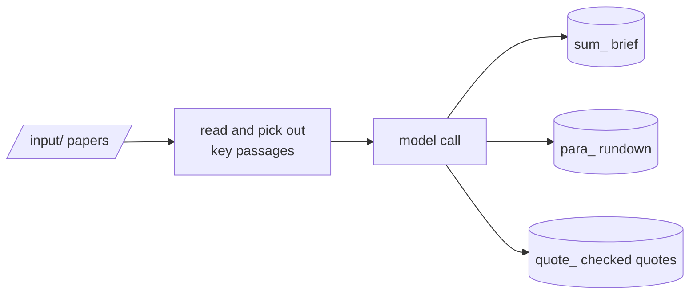

# pepa-sum

Turns each paper in a folder (PDF, markdown or text) into three documents: a structured brief, a
paragraph-by-paragraph rundown, and quotes checked word for word against the source. The heavy
reading happens locally; only a compact prompt goes to the language model.

## How it works

The text is read, its reference list removed, and its key phrases, entities and claims picked out
locally. The model writes the brief and the rundown from that, and chooses quotes from passages
retrieved locally. A quote that does not appear verbatim in the paper is dropped.



Every brief has the same fields: question and context, empirical context, literature drawn on,
methods, arguments, key conclusions, and discussion items.

## Setup

```powershell
pip install -r requirements.txt
python -m spacy download en_core_web_sm
python manage.py install
```

`install` stores the Anthropic key; for another provider, set `BACKEND: "openai-compatible"`,
`LLM_BASE_URL` and `LLM_MODEL` in `env.yaml`. Put the papers into `input/`.

## Commands

| Action | Command |
|---|---|
| Summarise every paper in the input folder | `python manage.py summarize` |
| Remove failed outputs so they are redone | `python manage.py clean` |
| Choose the backend and speed | `python manage.py settings` |
| Show the configuration | `python manage.py config` |
| Check dependencies | `python manage.py install` |
